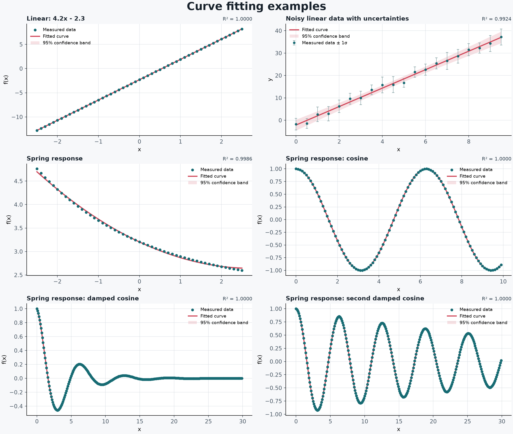

# Curve Fitting Examples

This folder contains a ready-to-open PandaPlot project with six datasets, a fitted chart for each dataset, and a short note explaining each model choice.



## Open the project

The generated project is `curve_fitting_examples.pplot`. Open PandaPlot and choose **File > Open Project**, then select that file.

To regenerate it from the bundled source data, run this command from the repository root:

```powershell
uv run python examples/curve_fitting/create_curve_fitting_example.py
```

The generator creates both the `.pplot` project and this six-chart PNG preview. The project includes a straight-line fit, a weighted straight-line fit using the supplied uncertainties, a quadratic fit, a cosine fit, and two damped-cosine fits. The weighted-linear chart displays the supplied Y error bars. Every fitted curve includes a confidence band, equation, parameter values, and R²; the adjacent note explains why its model was chosen.